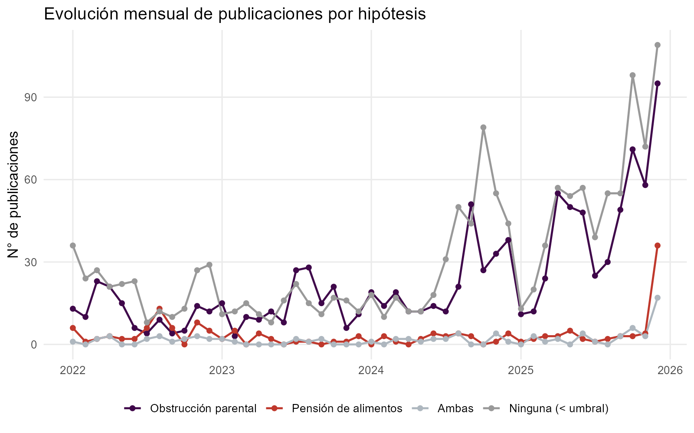

# Análisis nivel 1: caracterización general

## NLI: Probabilidad de asociarse a los temas

El funcionamiento es a partir de un *Natural Language Inference* (NLI), que trabaja desde el testeo de hipótesis propio de la *estadística inferencial*. Se construye una hipótesis para cada etiqueta, de modo que **la hipotesis refiere a la existencia de una relación entre el texto y la tematica**.

Para el caso de nuestras dos temáticas sería:

::: columns
::: {.column width="50%"}
::: {.callout-important title="Obstrucción parental" icon="false"}
H1: *Este texto es sobre obstrucción parental*
:::
:::

::: {.column width="50%"}
::: {.callout-important title="Pensión de alimentos" icon="false"}
H2: *Este texto es sobre pensión de alimentos*
:::
:::
:::

El **texto** es la **descripción** de la publicación.

En ese sentido, el modelo calcula la **probabilidad de implicancia (entailment)** y **contradicción** con la hipótesis (etiqueta) para cada descripción.

Para la asignación de etiquetas no se fuerza a que las descripciones tributen a una sola temática, sino que también existe la posibilidad de que tirbute a *ambas* o a *ninguna*. Esto es posible debido a que cada hipotesis se evalua en su propio par indepdiente de probabilidades por descripción y no a nivel de todas las descripciones (a ello se le entiende como *zero-shot classification*).

La lógica de asignación es la siguiente: 

| | P(H2) < 0.5 | P(H2) ≥ 0.5 |
|---|---|---|
| **P(H1) ≥ 0.5** | `obstruccion_parental` | `ambas` |
| **P(H1) < 0.5** | `ninguna` | `pension_alimentos` |

Lo que nos interesa son las **probabilidades de *entailment*** para cada temática.

- **P(H2) < 0.5**: La probabilidad de que la descripción no se asocie al tema "*obstrucción parental*" (probabilidad de entailment es *menor* a 50%)
- **P(H2) ≥ 0.5**: La probabilidad de que la descripción se asocie al tema "*obstrucción parental*" (probabilidad de entailment es *mayor o igual* a 50%)
- **P(H2) < 0.5**: La probabilidad de que la descripción no se asocie al tema *"pensión de alimentos*" (probabilidad de entailment es *menor* a 50%)
- **P(H2) ≥ 0.5**: La probabilidad de que la descripción se asocie al tema "*pensión de alimentos*" (probabilidad de entailment es *mayor o igual* a 50%)

El modelo considera cuatro posibles etiquetas:

::: columns
::: {.column width="50%"}
::: {.callout-warning title="Obstrucción parental" icon="false"}
Cuando la probabilidad de asociarse al tema de obstrucción parental es mayor o igual a 50% y la probabilidad de asociarse al tema de pensión de alimentos es menor a 50%.
:::
:::

::: {.column width="50%"}
::: {.callout-warning title="Pensión de alimentos" icon="false"}
Cuando la probabilidad de asociarse al tema de pensión de alimentos es mayor o igual a 50% y la probabilidad de asociarse al tema de obstrucción parental es menor a 50%.
:::
:::
:::

::: columns
::: {.column width="50%"}
::: {.callout-warning title="Ambas" icon="false"}
Cuando la probabilidad de asociarse al tema de obstrucción parental es mayor o igual a 50% y la probabilidad de asociarse al tema de pensión de alimentos es mayor o igual a 50%.
:::
:::

::: {.column width="50%"}
::: {.callout-warning title="Ninguna" icon="false"}
Cuando la probabilidad de asociarse al tema de obstrucción parental es menor a 50% y la probabilidad de asociarse al tema de pensión de alimentos es menor a 50%.
:::
:::
:::

A continuación solo nos enfocaremos en los resultados para la asignación de las etiquetas `obstruccion_parental`y `pension_alimentos`.


### 1. Tema: Obstrucción parental

```{r}
#| echo: false
#| warning: false
#| message: false

# cargar paquetes -------------------------------------------------------------
pacman::p_load(readr, janitor, dplyr, ggplot2, purrr, knitr, kableExtra,
               tidytext, tidyr, sjPlot, tidyverse,  scales, sjPlot, stargazer,
               texreg, haven, sjlabelled, summarytools, ggtext, ggpubr,
               hrbrthemes, stringr, DT, htmltools, quanteda)

# cargar datos ----------------------------------------------------------------
df <- read_csv("tabla_cuenta_x_etiqueta.csv", show_col_types = FALSE)

d_op <- df %>% filter(etiqueta == "obstruccion_parental")

# grafico ---------------------------------------------------------------------

ggplot(d_op,
       aes(x = cuenta, y = n)) +
  
  geom_col(
    fill = c("#D8B4F8", 
                                 "#3F074A", 
                                 "#BF382C", 
                                 "#AEB7BF",
                                 "#44322F", 
                                 "#999999"),
    position = position_dodge(width = 0.8, preserve = "single"),
    width = 0.6
  ) +
  
  geom_text(
    aes(label = n),
    position = position_dodge(width = 0.8, preserve = "single"),
    hjust = -0.3
  ) +
  
  scale_y_continuous(
    limits = c(0, 400),
    breaks = c(0, 50, 100, 150, 200, 250, 300, 350, 400),
    expand = expansion(mult = c(0, 0.10))
  ) +
  
  labs(
    title = "Cantidad de publicaciones asociadas a la etiqueta",
    subtitle = "Resumen por cuenta",
    x = "",
    y = "Frecuencia",
    caption = "Fuente: Elaboración propia."
  ) +
  
  coord_flip() +
  
  theme_minimal(base_size = 13) +
  
  theme(
    plot.title = element_text(face = "bold", size = 14),
    plot.subtitle = element_text(size = 12)
   # axis.text.x = element_text(angle = 45, hjust = 1)
  )


```

```{r}
#| echo: false
#| warning: false
#| message: false
#| label: descripciones-op

# resguardo de portabilidad: fuerza una configuración regional con soporte
# UTF-8 para que tildes/ñ en las descripciones no se pierdan al renderizar
# (se detectó este problema en un entorno Linux con locale "C"; en Windows
# normalmente no debería hacer falta, pero no tiene costo probar varias
# alternativas hasta que una funcione, y no falla si ninguna aplica).
for (loc_utf8 in c("en_US.UTF-8", "C.UTF-8", "en_US.utf8", "C.utf8",
                    "Spanish_Chile.utf8", "English_United States.UTF-8")) {
  if (suppressWarnings(Sys.setlocale("LC_CTYPE", loc_utf8)) != "") break
}

df <- read_csv("probabilidades_hipotesis.csv", show_col_types = FALSE)

# separar por mes y año --------------------------------------------------------
# fecha viene en formato ISO 8601 (ej. "2025-12-31T15:18:02.000Z"); hay que
# parsearla con lubridate antes de extraer año/mes -si se usa format() directo
# sobre el texto crudo, año y mes quedan mal calculados.
meses_nombre <- c(
  "01" = "enero", "02" = "febrero", "03" = "marzo", "04" = "abril",
  "05" = "mayo", "06" = "junio", "07" = "julio", "08" = "agosto",
  "09" = "septiembre", "10" = "octubre", "11" = "noviembre", "12" = "diciembre"
)

df <- df %>%
  mutate(
    fecha_parseada = ymd_hms(fecha, tz = "UTC", quiet = TRUE),
    anio    = format(fecha_parseada, "%Y"),
    mes_num = format(fecha_parseada, "%m"),
    mes     = unname(meses_nombre[mes_num])
  )

# largo máximo de la descripción mostrada en las tablas (se trunca con "…")
LARGO_MAX_DESCRIPCION <- 2000

# función genérica para las tablas interactivas de detalle --------------------
# (mismo patrón de tabla_frecuencias_interactiva() usado en el book de DEG:
# DT::datatable() en HTML, con fallback a kableExtra para salidas no-HTML)
tabla_detalle_interactiva <- function(datos, pageLength = 10, orden_col = 3,
                                       col_pct = NULL, pct_digits = 1) {
  if (nrow(datos) == 0) {
    cat("_No hay publicaciones para este panel._\n\n")
    return(invisible(NULL))
  }
  if (knitr::is_html_output()) {
    tabla <- DT::datatable(
      datos,
      rownames = FALSE,
      options = list(
        pageLength = pageLength,
        autoWidth = TRUE,
        dom = 'ftip',
        order = list(list(orden_col, "desc")),
        language = list(
          search = "Buscar:",
          info = "Mostrando _START_ a _END_ de _TOTAL_",
          paginate = list(previous = "Anterior", `next` = "Siguiente"),
          zeroRecords = "Sin resultados"
        )
      )
    )
    if (!is.null(col_pct)) {
      tabla <- DT::formatPercentage(tabla, columns = col_pct, digits = pct_digits)
    }
    tabla
  } else {
    # Namespace explícito (kableExtra::) para que funcione aunque el paquete
    # no se haya cargado con library()/pacman::p_load() en la sesión actual
    # (pasa, por ejemplo, si corres este chunk suelto en RStudio sin haber
    # corrido antes el primer chunk del documento).
    datos %>%
      mutate(across(all_of(col_pct), ~ percent(.x, accuracy = 10^(-pct_digits)))) %>%
      kableExtra::kbl(booktabs = TRUE, longtable = TRUE) %>%
      kableExtra::kable_styling(latex_options = c("striped", "repeat_header"), full_width = TRUE)
  }
}
```

#### Detalle de publicaciones: obstrucción parental por año

Se muestran solo las publicaciones etiquetadas como `obstruccion_parental` (probabilidad ≥ umbral), ordenadas por probabilidad de mayor a menor dentro de cada panel. Cada pestaña corresponde a un año.

::: panel-tabset
```{r}
#| echo: false
#| warning: false
#| message: false
#| results: asis

d_op_desc_anio <- df %>%
  filter(etiqueta == "obstruccion_parental", anio %in% c("2022", "2023", "2024", "2025")) %>%
  arrange(desc(prob_obstruccion_parental)) %>%
  transmute(
    anio,
    Descripcion = ifelse(
      nchar(descripcion) > LARGO_MAX_DESCRIPCION,
      paste0(str_sub(descripcion, 1, LARGO_MAX_DESCRIPCION), "…"),
      descripcion
    ),
    Cuenta = cuenta,
    Mes = mes,
    Probabilidad = prob_obstruccion_parental,
    `Me gusta` = me_gusta
  )

anios_orden <- c("2025", "2024", "2023", "2022")

# IMPORTANTE: no se usa print(tagList(...)) dentro del loop -si se llama a
# print() explícitamente sobre un widget de DT dentro de un chunk
# results:asis, las dependencias JS de DataTables no se registran y la
# tabla queda vacía (contenedor + datos sin la tabla real). knit_child()
# evita esto: cada panel se evalúa como su propio mini-documento, así el
# widget se auto-imprime como valor final del chunk (que sí funciona) en
# vez de vía un print() manual.
paneles_anio <- lapply(anios_orden, function(a) {
  datos_panel <- d_op_desc_anio %>%
    filter(anio == a) %>%
    select(-anio)

  knitr::knit_child(
    text = c(
      sprintf("## %s\n", a),
      "```{r}",
      "#| echo: false",
      "#| warning: false",
      "#| message: false",
      "#| results: asis",
      "tabla_detalle_interactiva(datos_panel, col_pct = 'Probabilidad')",
      "```",
      ""
    ),
    envir = environment(),
    quiet = TRUE
  )
})

cat(unlist(paneles_anio), sep = "\n")
```
:::

#### Detalle de publicaciones: obstrucción parental por cuenta

Mismas publicaciones que arriba, pero organizadas con una pestaña por cuenta en vez de por año (incluye todos los años disponibles).

::: panel-tabset
```{r}
#| echo: false
#| warning: false
#| message: false
#| results: asis

d_op_desc_cuenta <- df %>%
  filter(etiqueta == "obstruccion_parental") %>%
  arrange(desc(prob_obstruccion_parental)) %>%
  transmute(
    cuenta,
    Descripcion = ifelse(
      nchar(descripcion) > LARGO_MAX_DESCRIPCION,
      paste0(str_sub(descripcion, 1, LARGO_MAX_DESCRIPCION), "…"),
      descripcion
    ),
    Mes = mes,
    Anio = anio,
    Probabilidad = prob_obstruccion_parental,
    `Me gusta` = me_gusta
  )

cuentas_orden <- d_op_desc_cuenta %>% distinct(cuenta) %>% arrange(cuenta) %>% pull(cuenta)

# ver comentario en el chunk anterior: knit_child() en vez de print(tagList())
paneles_cuenta <- lapply(cuentas_orden, function(cta) {
  datos_panel <- d_op_desc_cuenta %>%
    filter(cuenta == cta) %>%
    select(-cuenta)

  knitr::knit_child(
    text = c(
      sprintf("## %s\n", cta),
      "```{r}",
      "#| echo: false",
      "#| warning: false",
      "#| message: false",
      "#| results: asis",
      "tabla_detalle_interactiva(datos_panel, col_pct = 'Probabilidad')",
      "```",
      ""
    ),
    envir = environment(),
    quiet = TRUE
  )
})

cat(unlist(paneles_cuenta), sep = "\n")
```
:::

#### Top 10: publicaciones más representativas de obstrucción parental

```{r}
#| label: top-10
#| echo: false
#| warning: false
#| message: false

top10_op <- read_csv("graficos/top10_obstruccion_parental.csv", show_col_types = FALSE)

top10_op_tabla <- top10_op %>%
  mutate(
    fecha_parseada = ymd_hms(fecha, tz = "UTC", quiet = TRUE),
    anio    = format(fecha_parseada, "%Y"),
    mes_num = format(fecha_parseada, "%m"),
    mes     = unname(meses_nombre[mes_num])
  ) %>%
  arrange(desc(prob_obstruccion_parental)) %>%
  transmute(
    Cuenta = cuenta,
    Mes = mes,
    Anio = anio,
    `Me gusta` = me_gusta,
    Descripcion = ifelse(
      nchar(descripcion) > LARGO_MAX_DESCRIPCION,
      paste0(str_sub(descripcion, 1, LARGO_MAX_DESCRIPCION), "…"),
      descripcion
    ),
    Probabilidad = prob_obstruccion_parental
  )

tabla_detalle_interactiva(top10_op_tabla, pageLength = 10, orden_col = 5, col_pct = "Probabilidad")
```

#### Top 10 por cuenta: publicaciones más representativas de obstrucción parental

::: panel-tabset
```{r}
#| label: top-10-cuenta-op
#| echo: false
#| warning: false
#| message: false
#| results: asis

top10_cuenta_op_tabla <- df %>%
  group_by(cuenta) %>%
  slice_max(order_by = prob_obstruccion_parental, n = 10, with_ties = FALSE) %>%
  ungroup() %>%
  arrange(cuenta, desc(prob_obstruccion_parental)) %>%
  transmute(
    cuenta,
    Mes = mes,
    Anio = anio,
    `Me gusta` = me_gusta,
    Descripcion = ifelse(
      nchar(descripcion) > LARGO_MAX_DESCRIPCION,
      paste0(str_sub(descripcion, 1, LARGO_MAX_DESCRIPCION), "…"),
      descripcion
    ),
    Link = link,
    Probabilidad = prob_obstruccion_parental
  )

cuentas_orden_top10_op <- top10_cuenta_op_tabla %>% distinct(cuenta) %>% arrange(cuenta) %>% pull(cuenta)

# ver comentario en las secciones "por cuenta" de más arriba: knit_child() en
# vez de print(tagList()), para que las dependencias JS de cada tabla DT se
# registren correctamente dentro de un chunk results:asis con varios paneles
paneles_top10_cuenta_op <- lapply(cuentas_orden_top10_op, function(cta) {
  datos_panel <- top10_cuenta_op_tabla %>%
    filter(cuenta == cta) %>%
    select(-cuenta)

  knitr::knit_child(
    text = c(
      sprintf("## %s\n", cta),
      "```{r}",
      "#| echo: false",
      "#| warning: false",
      "#| message: false",
      "#| results: asis",
      "tabla_detalle_interactiva(datos_panel, pageLength = 10, orden_col = 5, col_pct = 'Probabilidad')",
      "```",
      ""
    ),
    envir = environment(),
    quiet = TRUE
  )
})

cat(unlist(paneles_top10_cuenta_op), sep = "\n")
```
:::

### 2. Tema: Pensión de alimentos

```{r}
#| echo: false
#| warning: false
#| message: false

# Nota: se recarga tabla_cuenta_x_etiqueta.csv (en vez de reusar `df`) porque
# el chunk "descripciones-op" sobrescribió `df` con el detalle por publicación
# de probabilidades_hipotesis.csv, que no tiene la columna `n` (conteo) que
# necesita este gráfico.
df_conteo <- read_csv("tabla_cuenta_x_etiqueta.csv", show_col_types = FALSE)

d_pa <- df_conteo %>% filter(etiqueta == "pension_alimentos")

# grafico ---------------------------------------------------------------------

ggplot(d_pa,
       aes(x = cuenta, y = n)) +
  
  geom_col(
    fill = c("#D8B4F8", 
                                 "#3F074A", 
                                 "#BF382C", 
                                 "#AEB7BF",
                                 "#44322F", 
                                 "#999999"),
    position = position_dodge(width = 0.8, preserve = "single"),
    width = 0.6
  ) +
  
  geom_text(
    aes(label = n),
    position = position_dodge(width = 0.8, preserve = "single"),
    hjust = -0.3
  ) +
  
  scale_y_continuous(
    limits = c(0, 400),
    breaks = c(0, 50, 100, 150, 200, 250, 300, 350, 400),
    expand = expansion(mult = c(0, 0.10))
  ) +
  
  labs(
    title = "Cantidad de publicaciones asociadas a la etiqueta",
    subtitle = "Resumen por cuenta",
    x = "",
    y = "Frecuencia",
    caption = "Fuente: Elaboración propia."
  ) +
  
  coord_flip() +
  
  theme_minimal(base_size = 13) +
  
  theme(
    plot.title = element_text(face = "bold", size = 14),
    plot.subtitle = element_text(size = 12)
   # axis.text.x = element_text(angle = 45, hjust = 1)
  )


```

#### Detalle de publicaciones: pensión de alimentos por año

Se muestran solo las publicaciones etiquetadas como `pension_alimentos` (probabilidad ≥ umbral), ordenadas por probabilidad de mayor a menor dentro de cada panel. Cada pestaña corresponde a un año.

::: panel-tabset
```{r}
#| echo: false
#| warning: false
#| message: false
#| results: asis

d_pa_desc_anio <- df %>%
  filter(etiqueta == "pension_alimentos", anio %in% c("2022", "2023", "2024", "2025")) %>%
  arrange(desc(prob_pension_alimentos)) %>%
  transmute(
    anio,
    Descripcion = ifelse(
      nchar(descripcion) > LARGO_MAX_DESCRIPCION,
      paste0(str_sub(descripcion, 1, LARGO_MAX_DESCRIPCION), "…"),
      descripcion
    ),
    Cuenta = cuenta,
    Mes = mes,
    Probabilidad = prob_pension_alimentos,
    `Me gusta` = me_gusta
  )

anios_orden <- c("2025", "2024", "2023", "2022")

# IMPORTANTE: no se usa print(tagList(...)) dentro del loop -si se llama a
# print() explícitamente sobre un widget de DT dentro de un chunk
# results:asis, las dependencias JS de DataTables no se registran y la
# tabla queda vacía (contenedor + datos sin la tabla real). knit_child()
# evita esto: cada panel se evalúa como su propio mini-documento, así el
# widget se auto-imprime como valor final del chunk (que sí funciona) en
# vez de vía un print() manual.
paneles_anio <- lapply(anios_orden, function(a) {
  datos_panel <- d_pa_desc_anio %>%
    filter(anio == a) %>%
    select(-anio)

  knitr::knit_child(
    text = c(
      sprintf("## %s\n", a),
      "```{r}",
      "#| echo: false",
      "#| warning: false",
      "#| message: false",
      "#| results: asis",
      "tabla_detalle_interactiva(datos_panel, col_pct = 'Probabilidad')",
      "```",
      ""
    ),
    envir = environment(),
    quiet = TRUE
  )
})

cat(unlist(paneles_anio), sep = "\n")
```
:::

#### Detalle de publicaciones: pensión de alimentos por cuenta

Mismas publicaciones que arriba, pero organizadas con una pestaña por cuenta en vez de por año (incluye todos los años disponibles).

::: panel-tabset
```{r}
#| echo: false
#| warning: false
#| message: false
#| results: asis

d_pa_desc_cuenta <- df %>%
  filter(etiqueta == "pension_alimentos") %>%
  arrange(desc(prob_pension_alimentos)) %>%
  transmute(
    cuenta,
    Descripcion = ifelse(
      nchar(descripcion) > LARGO_MAX_DESCRIPCION,
      paste0(str_sub(descripcion, 1, LARGO_MAX_DESCRIPCION), "…"),
      descripcion
    ),
    Mes = mes,
    Anio = anio,
    Probabilidad = prob_pension_alimentos,
    `Me gusta` = me_gusta
  )

cuentas_orden <- d_pa_desc_cuenta %>% distinct(cuenta) %>% arrange(cuenta) %>% pull(cuenta)

# ver comentario en el chunk anterior: knit_child() en vez de print(tagList())
paneles_cuenta <- lapply(cuentas_orden, function(cta) {
  datos_panel <- d_pa_desc_cuenta %>%
    filter(cuenta == cta) %>%
    select(-cuenta)

  knitr::knit_child(
    text = c(
      sprintf("## %s\n", cta),
      "```{r}",
      "#| echo: false",
      "#| warning: false",
      "#| message: false",
      "#| results: asis",
      "tabla_detalle_interactiva(datos_panel, col_pct = 'Probabilidad')",
      "```",
      ""
    ),
    envir = environment(),
    quiet = TRUE
  )
})

cat(unlist(paneles_cuenta), sep = "\n")
```
:::

#### Top 10: publicaciones más representativas de pensión de alimentos

```{r}
#| label: top-10-pa
#| echo: false
#| warning: false
#| message: false

top10_pa <- read_csv("graficos/top10_pension_alimentos.csv", show_col_types = FALSE)

top10_pa_tabla <- top10_pa %>%
  mutate(
    fecha_parseada = ymd_hms(fecha, tz = "UTC", quiet = TRUE),
    anio    = format(fecha_parseada, "%Y"),
    mes_num = format(fecha_parseada, "%m"),
    mes     = unname(meses_nombre[mes_num])
  ) %>%
  arrange(desc(prob_pension_alimentos)) %>%
  transmute(
    Cuenta = cuenta,
    Mes = mes,
    Anio = anio,
    `Me gusta` = me_gusta,
    Descripcion = ifelse(
      nchar(descripcion) > LARGO_MAX_DESCRIPCION,
      paste0(str_sub(descripcion, 1, LARGO_MAX_DESCRIPCION), "…"),
      descripcion
    ),
    Probabilidad = prob_pension_alimentos
  )

tabla_detalle_interactiva(top10_pa_tabla, pageLength = 10, orden_col = 5, col_pct = "Probabilidad")
```

#### Top 10 por cuenta: publicaciones más representativas de pensión de alimentos

::: panel-tabset
```{r}
#| label: top-10-cuenta-pa
#| echo: false
#| warning: false
#| message: false
#| results: asis

top10_cuenta_pa_tabla <- df %>%
  group_by(cuenta) %>%
  slice_max(order_by = prob_pension_alimentos, n = 10, with_ties = FALSE) %>%
  ungroup() %>%
  arrange(cuenta, desc(prob_pension_alimentos)) %>%
  transmute(
    cuenta,
    Mes = mes,
    Anio = anio,
    `Me gusta` = me_gusta,
    Descripcion = ifelse(
      nchar(descripcion) > LARGO_MAX_DESCRIPCION,
      paste0(str_sub(descripcion, 1, LARGO_MAX_DESCRIPCION), "…"),
      descripcion
    ),
    Link = link,
    Probabilidad = prob_pension_alimentos
  )

cuentas_orden_top10_pa <- top10_cuenta_pa_tabla %>% distinct(cuenta) %>% arrange(cuenta) %>% pull(cuenta)

# ver comentario en las secciones "por cuenta" de más arriba: knit_child() en
# vez de print(tagList()), para que las dependencias JS de cada tabla DT se
# registren correctamente dentro de un chunk results:asis con varios paneles
paneles_top10_cuenta_pa <- lapply(cuentas_orden_top10_pa, function(cta) {
  datos_panel <- top10_cuenta_pa_tabla %>%
    filter(cuenta == cta) %>%
    select(-cuenta)

  knitr::knit_child(
    text = c(
      sprintf("## %s\n", cta),
      "```{r}",
      "#| echo: false",
      "#| warning: false",
      "#| message: false",
      "#| results: asis",
      "tabla_detalle_interactiva(datos_panel, pageLength = 10, orden_col = 5, col_pct = 'Probabilidad')",
      "```",
      ""
    ),
    envir = environment(),
    quiet = TRUE
  )
})

cat(unlist(paneles_top10_cuenta_pa), sep = "\n")
```
:::

### 3. Evolución mensual



## Frecuencia de frases

Conteo de las veces que aparece **literalmente** la frase "*obstrucción parental*" y la frase "*pensión de alimentos*" dentro de las descripciones, y cómo varía esa frecuencia año a año. 

Es un conteo léxico exacto (solo menciones textuales explícitas de la frase completa).

```{r}
#| label: freq
#| echo: false
#| warning: false
#| message: false

# Diccionario de frases a contar como unidad exacta: "obstrucción_parental" y
# "pensión_de_alimentos" solo cuentan si las palabras aparecen juntas y en ese
# orden -contarlas como palabras sueltas sobreestimaría los casos en que
# aparecen en el texto pero no una junto a la otra-.
frases_dict <- dictionary(list(
  obstruccion_parental = "obstrucción_parental",
  pension_alimentos    = "pensión_de_alimentos"
))

nombre_frase_legible <- c(
  obstruccion_parental = "Obstrucción parental",
  pension_alimentos    = "Pensión de alimentos"
)
color_frase <- c(
  obstruccion_parental = "#3F074A",
  pension_alimentos    = "#BF382C"
)

df_freq_base <- df %>%
  filter(!is.na(anio), anio %in% c("2022", "2023", "2024", "2025")) %>%
  mutate(doc_id = as.character(row_number()))

# se compone la frase como un solo token ("obstrucción_parental") antes de
# contarla, para que la búsqueda exija que las palabras aparezcan contiguas
toks_freq <- corpus(df_freq_base, text_field = "descripcion", docid_field = "doc_id") %>%
  tokens(remove_punct = TRUE) %>%
  tokens_tolower() %>%
  tokens_compound(pattern = phrase(c("obstrucción parental", "pensión de alimentos")))

dfm_freq <- dfm(toks_freq) %>%
  dfm_lookup(frases_dict)

dfm_freq_anio <- dfm_group(dfm_freq, groups = docvars(dfm_freq, "anio"))

tabla_freq_anio <- convert(dfm_freq_anio, to = "data.frame") %>%
  rename(anio = doc_id) %>%
  arrange(anio)

# tabla ------------------------------------------------------------------
tabla_freq_mostrar <- tabla_freq_anio %>%
  rename(
    Año = anio,
    `Obstrucción parental` = obstruccion_parental,
    `Pensión de alimentos` = pension_alimentos
  )

if (knitr::is_html_output()) {
  DT::datatable(
    tabla_freq_mostrar,
    rownames = FALSE,
    options = list(
      pageLength = 10,
      dom = 't',
      ordering = FALSE,
      language = list(zeroRecords = "Sin resultados")
    )
  )
} else {
  tabla_freq_mostrar %>%
    kableExtra::kbl(booktabs = TRUE) %>%
    kableExtra::kable_styling(latex_options = "striped", full_width = TRUE)
}
```

```{r}
#| echo: false
#| warning: false
#| message: false

# grafico ------------------------------------------------------------------
grafico_freq_anio <- tabla_freq_anio %>%
  pivot_longer(
    cols = c(obstruccion_parental, pension_alimentos),
    names_to = "frase", values_to = "n_apariciones"
  ) %>%
  mutate(frase = factor(frase, levels = names(color_frase)))

ggplot(grafico_freq_anio, aes(x = anio, y = n_apariciones, color = frase, group = frase)) +

  geom_line(linewidth = 0.8) +

  geom_point(size = 2) +

  geom_text(
    aes(label = n_apariciones),
    vjust = -0.9,
    show.legend = FALSE,
    size = 3.5
  ) +

  scale_color_manual(values = color_frase, labels = nombre_frase_legible, name = NULL) +

  scale_y_continuous(expand = expansion(mult = c(0.05, 0.15))) +

  labs(
    title = "Frecuencia de cada frase en las descripciones",
    subtitle = "Conteo de apariciones por año",
    x = "",
    y = "Frecuencia",
    caption = "Fuente: Elaboración propia."
  ) +

  theme_minimal(base_size = 12) +

  theme(
    legend.position = "bottom",
    panel.grid.minor = element_blank()
  )
```

### Oraciones enlas que aparecen las frases

```{r}
#| echo: false
#| warning: false
#| message: false

# tokens sin fusionar (a diferencia de toks_freq del chunk "freq") para poder
# buscar cada frase como tal con kwic() y ver su contexto real; se reutiliza
# df_freq_base (mismas publicaciones 2022-2025, ya con doc_id) del chunk "freq"
toks_descripciones <- corpus(df_freq_base, text_field = "descripcion", docid_field = "doc_id") %>%
  tokens(remove_punct = TRUE)

# se almacena en el objeto keywords las frases que nos interesen
keywords <- c("obstrucción parental", "pensión de alimentos")

# inicializamos la lista de contextos
contexto_descripcion <- list()

# iteramos el cálculo de las 12 palabras anteriores y las 12 palabras
# posteriores a cada frase (phrase() para que busque la frase completa y
# contigua, no cada palabra suelta por su cuenta)
for (i in keywords) {
  contexto_descripcion[[i]] <- toks_descripciones %>% kwic(pattern = phrase(i), window = 50)
}
```

```{r}
#| echo: false
#| warning: false
#| message: false

generar_tabla <- function(contexto_descripcion_list, i) {

  # extraimos el tópico correspondiente
  letra <- contexto_descripcion_list[[i]]
  
  # se convierte en data frame y se seleccionan las tres columnas a visualizar en la tabla
  letra <- as.data.frame(letra) %>% select(pre, keyword, post)
  
  # creamos objeto tabla con su formato personalizado 
 tabla <- letra %>% 
  knitr::kable(
    format = "html",
    align = "c",
    col.names = c("Oración anterior", "Palabra", "Oración posterior")
  ) %>%
  kableExtra::kable_styling(
    bootstrap_options = "basic",
    full_width = FALSE,
    position = "center",
    font_size = 12
  ) %>%
  # Encabezado en negrita, sin color de fondo
  kableExtra::row_spec(
    0,
    bold = TRUE,
    background = "white",
    extra_css = "border-top: 2px solid black; border-bottom: 1px solid black;"
  ) %>%
  # Filas del cuerpo sin fondo alternado
  kableExtra::column_spec(1, background = "white") %>%
  kableExtra::column_spec(2, background = "white", bold = FALSE) %>%
  kableExtra::column_spec(3, background = "white") %>%
  # Línea inferior de la tabla
  kableExtra::row_spec(
    nrow(letra),
    extra_css = "border-bottom: 2px solid black;"
  )
  
  
  # retorna la tabla 
  return(tabla)
}


```

#### Obstrucción parental

```{r}
#| warning: false
#| echo: false
generar_tabla(contexto_descripcion, "obstrucción parental")
```

#### Pensión de alimentos

```{r}
#| warning: false
#| echo: false
generar_tabla(contexto_descripcion, "pensión de alimentos")
```
